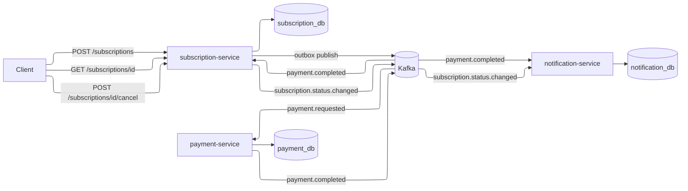
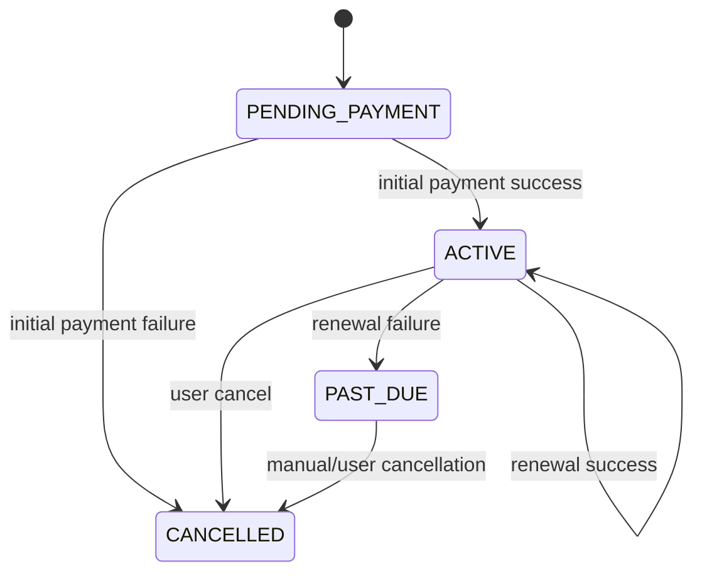
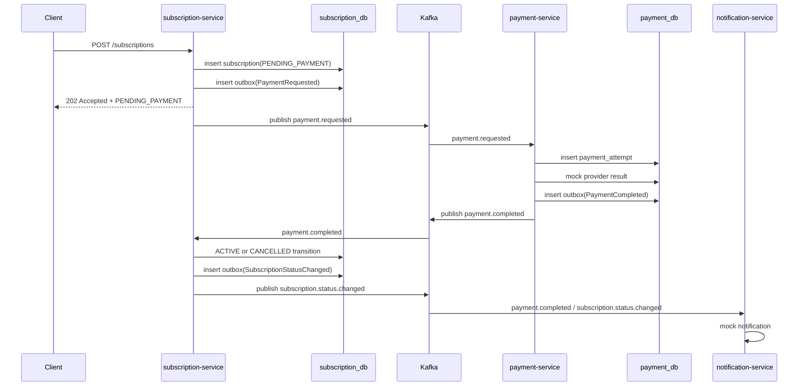
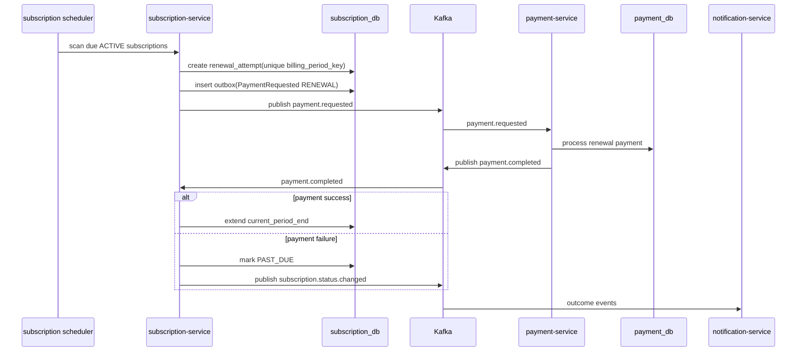

# Architecture

## Summary

This system is a small event-driven architecture that keeps subscription lifecycle ownership inside `subscription-service`.

- `subscription-service` manages subscription state transitions and renewal scheduling
- `payment-service` processes payment requests and publishes payment outcomes
- `notification-service` listens to outcome events and creates mock notifications

Core safety principles:

- a subscription never becomes `ACTIVE` before payment succeeds
- service coordination uses `outbox + asynchronous events`, not `2PC`
- duplicate delivery is treated as normal and handled with idempotent consumers
- outbox publishers use `claim + SKIP LOCKED` so multiple instances do not claim the same row at the same time

In this case implementation, `paymentMethodToken` is not modeled as real card data. It is a test-oriented control input used to trigger deterministic success or failure behavior in the mock payment provider.

## High-Level Diagram

## Service Boundaries

### `subscription-service`

Responsibilities:

- manage `PENDING_PAYMENT`, `ACTIVE`, `CANCELLED`, and `PAST_DUE`
- make create, cancel, and renewal decisions
- run the renewal scheduler
- apply lifecycle transitions after payment results arrive
- publish integration events through the outbox

Out of scope:

- producing payment outcomes
- making physical notification delivery decisions beyond emitting lifecycle signals

### `payment-service`

Responsibilities:

- consume `payment.requested`
- create a single payment attempt per logical payment request
- call the mock payment provider
- publish `payment.completed` through the outbox

Out of scope:

- deciding subscription state
- activating or canceling subscriptions

### `notification-service`

Responsibilities:

- consume `payment.completed` and `subscription.status.changed`
- create mock notifications
- log delivery attempts

Out of scope:

- mutating payment or subscription state

## Internal Service Structure

The services follow a hexagonal structure.

- `application.port.in`
  - use-case interfaces
  - entry contracts used by inbound adapters
- `application.port.out`
  - outbound contracts for persistence and messaging
- `application.service`
  - use-case implementations
  - business orchestration happens here
- `adapter.in`
  - web, messaging, and scheduler entry points
  - they depend on use-cases instead of concrete services
- `adapter.out`
  - infrastructure adapters such as JPA and Kafka
  - they implement outbound ports
- `domain`
  - domain objects without JPA annotations
  - business rules and state transition behavior live here

Persistence rules:

- JPA classes use the `Entity` suffix
- entities live only under `adapter.out.persistence.entity`
- ports and application services do not expose entities
- entity/domain conversion is handled with MapStruct

## Data Ownership

Each service owns its own data and tables.

- `subscription_db`
  - `subscriptions`
  - `renewal_attempts`
  - `outbox_events`
  - `processed_events`
- `payment_db`
  - `payment_attempts`
  - `outbox_events`
  - `processed_events`
- `notification_db`
  - `notification_deliveries`
  - `processed_events`

No service accesses another service's tables.

## Subscription State Model

State meanings:

- `PENDING_PAYMENT`: subscription exists and is waiting for the payment result
- `ACTIVE`: initial payment succeeded and the access period is active
- `CANCELLED`: no more renewals will be created and no further charges will be made
- `PAST_DUE`: renewal failed and the subscription is now in a non-active state

## Reliability Notes

- outbox publishers do not publish `PENDING` rows directly; they first claim them as `IN_PROGRESS`
- claiming uses PostgreSQL `FOR UPDATE SKIP LOCKED`
- if publish fails, the row returns to `PENDING` and `retry_count` is incremented
- rows stuck in `IN_PROGRESS` can be reclaimed using `claimed_at` timeout logic
- consumers use a DLQ policy for parse failures and permanent processing failures
- DLQ topics:
  - `payment.requested.dlq`
  - `payment.completed.dlq`
  - `subscription.status.changed.dlq`

## Subscription Creation Flow

## Renewal Flow

## Event Contracts

### `payment.requested`

Fields:

- `eventId`
- `correlationId`
- `paymentRequestId`
- `subscriptionId`
- `userId`
- `planId`
- `paymentType`
- `billingPeriodKey`
- `amount`
- `currency`
- `paymentMethodToken`
- `requestedAt`

### `payment.completed`

Fields:

- `eventId`
- `correlationId`
- `paymentRequestId`
- `subscriptionId`
- `paymentType`
- `result`
- `providerReference`
- `failureReason`
- `processedAt`

### `subscription.status.changed`

Fields:

- `eventId`
- `correlationId`
- `subscriptionId`
- `oldStatus`
- `newStatus`
- `reason`
- `occurredAt`
