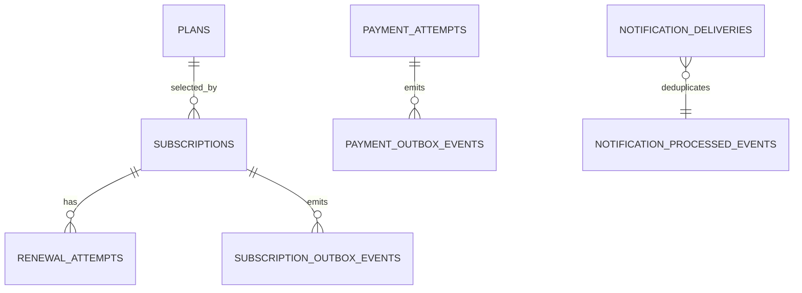

# Database Model

## Summary

The data model is separated by service. Each service stores only its own current state, integration support data, and idempotency data.

Goals:

- lifecycle correctness
- duplicate-safe processing
- retry-safe event publication
- explicit auditability

## Database Ownership

### `subscription_db`

Main tables:

- `plans`
- `subscriptions`
- `renewal_attempts`
- `outbox_events`
- `processed_events`

### `payment_db`

Main tables:

- `payment_attempts`
- `outbox_events`
- `processed_events`

### `notification_db`

Main tables:

- `notification_deliveries`
- `processed_events`

## Entity Relationship View

## Subscription DB

### `plans`

Purpose:

- stores supported subscription plans, prices, and billing attributes

Fields:

- `id` integer PK
- `code` varchar unique not null
- `name` varchar not null
- `price` numeric(19,2) not null
- `currency` varchar not null
- `billing_period_days` integer not null
- `active` boolean not null

Seed data:

- `1` (`basic`) -> `9.99 USD`, `30 days`
- `2` (`pro`) -> `19.99 USD`, `30 days`
- `3` (`enterprise`) -> `49.99 USD`, `30 days`

Notes:

- incoming `planId` is validated against this table during subscription creation
- subscriptions cannot be created for unknown or inactive plans

### `subscriptions`

Purpose:

- stores the current subscription state and billing period information

Fields:

- `id` UUID PK
- `user_id` UUID not null
- `plan_id` integer not null
- `status` varchar not null
- `auto_renew` boolean not null
- `payment_method_token` varchar not null
- `current_period_start` timestamptz null
- `current_period_end` timestamptz null
- `next_renewal_date` timestamptz null
- `initial_payment_request_id` UUID not null
- `version` bigint not null
- `created_at` timestamptz not null
- `updated_at` timestamptz not null
- `cancelled_at` timestamptz null
- `status_reason` varchar null

Important indexes and constraints:

- partial unique index: prevents a second open subscription for the same `user_id + plan_id`
- `next_renewal_date` index: supports scheduler scans
- foreign key: `plan_id -> plans.id`

Notes:

- open subscription means `PENDING_PAYMENT`, `ACTIVE`, or `PAST_DUE`
- `payment_method_token` stores the deterministic mock payment selector used by this case implementation; it should not be interpreted as a recommendation to persist raw card data in a real system

### `renewal_attempts`

Purpose:

- prevents duplicate renewal request creation for the same billing cycle

Fields:

- `id` UUID PK
- `subscription_id` UUID not null
- `billing_period_key` varchar not null
- `payment_request_id` UUID not null
- `status` varchar not null
- `created_at` timestamptz not null
- `updated_at` timestamptz not null

Important constraint:

- `unique(subscription_id, billing_period_key)`

### `outbox_events`

Purpose:

- stores integration events waiting to be published by the subscription service

Fields:

- `id` UUID PK
- `aggregate_type` varchar not null
- `aggregate_id` UUID not null
- `event_type` varchar not null
- `event_key` varchar not null
- `payload` text not null
- `status` varchar not null
- `published_at` timestamptz null
- `claimed_at` timestamptz null
- `retry_count` integer not null
- `created_at` timestamptz not null

Important constraint:

- `unique(event_key)`

### `processed_events`

Purpose:

- marks consumed events for idempotent handling

Fields:

- `event_id` UUID PK
- `consumer_name` varchar not null
- `processed_at` timestamptz not null
- `correlation_id` UUID null

## Payment DB

### `payment_attempts`

Purpose:

- stores one payment execution record for each logical payment request

Fields:

- `id` UUID PK
- `payment_request_id` UUID not null
- `subscription_id` UUID not null
- `user_id` UUID not null
- `plan_id` integer not null
- `payment_type` varchar not null
- `billing_period_key` varchar null
- `amount` numeric(19,2) not null
- `currency` varchar not null
- `status` varchar not null
- `provider_reference` varchar null
- `failure_reason` varchar null
- `correlation_id` UUID not null
- `created_at` timestamptz not null
- `updated_at` timestamptz not null

Important constraint:

- `unique(payment_request_id)`

### `outbox_events`

Purpose:

- stores durable `payment.completed` events waiting to be published

Structure:

- same column set as the subscription outbox
- supports multi-instance claim recovery through `claimed_at`

### `processed_events`

Purpose:

- prevents duplicate processing of `payment.requested`

## Notification DB

### `notification_deliveries`

Purpose:

- stores which mock notification type was created for which event

Fields:

- `id` UUID PK
- `event_id` UUID not null
- `subscription_id` UUID not null
- `user_id` UUID null
- `notification_type` varchar not null
- `channel` varchar not null
- `status` varchar not null
- `failure_reason` varchar null
- `attempt_count` integer not null
- `created_at` timestamptz not null
- `updated_at` timestamptz not null

Important constraint:

- `unique(event_id, notification_type, channel)`

### `processed_events`

Purpose:

- prevents duplicate deliveries for the same outcome event

## Design Notes

### Why current-state tables instead of event sourcing

Current-state tables were chosen for this case because:

- querying is simpler
- business rules are easier to read
- the reviewer can understand system behavior faster
