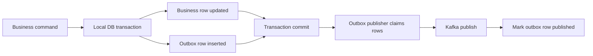
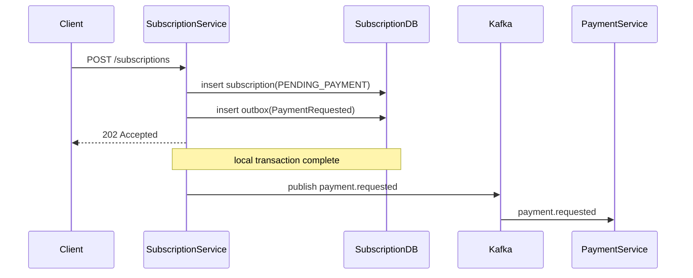
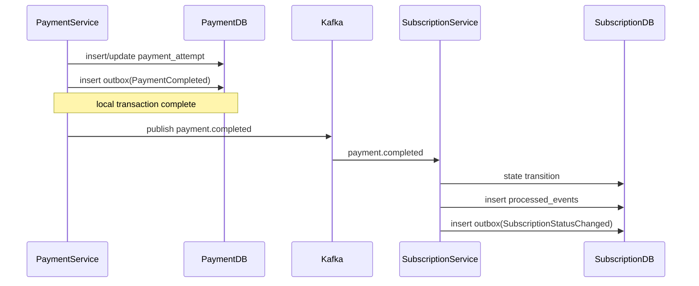

# Distributed Transaction Strategy

## Summary

This system does not use `2PC` for distributed consistency. Instead, each service commits its own local transaction, writes the integration event to an outbox table in the same transaction, and publishes the event to Kafka asynchronously afterward.

This choice solves three problems at the same time:

- it avoids tight runtime coupling between services
- business state is not lost when the broker or network is temporarily unavailable
- duplicate delivery can be handled safely through consumer idempotency

## Why Not 2PC

The case assumes the following conditions are normal:

- delayed responses
- partial service failures
- broker redelivery
- retry
- duplicate messages

For a small system like this, `2PC` would be too heavy:

- it requires cross-service commit coordination
- operational complexity increases
- failure modes become harder, not easier, to debug
- business ownership boundaries become less clear

## Chosen Model

The selected model is:

- local database transaction per service
- outbox table
- outbox claim with `FOR UPDATE SKIP LOCKED`
- asynchronous Kafka publication
- idempotent consumption through `processed_events`
- explicit consumer retry and DLQ policy

## Outbox Flow

Critical point:

- business data and the outbox record are written in the same transaction
- Kafka publishing happens later
- the publisher first claims the row as `IN_PROGRESS`
- if publish fails, the outbox record is not lost

## Initial Subscription Creation Transaction

The client response does not depend on Kafka publish success. This keeps the request path safer and more resilient.

## Payment Completion Transaction

## Failure Cases

### Case 1: DB commit succeeds, Kafka publish fails

Situation:

- business row is already committed
- the outbox row either remains `PENDING` or is reset to `PENDING` after failure
- the publisher will retry later

Result:

- the event is eventually published
- business state is not lost

### Case 1b: Process crashes after claiming the outbox row

Situation:

- the row is left in `IN_PROGRESS`
- the publisher crashes before publish completes

Protection:

- `claimed_at` timeout check
- timed-out `IN_PROGRESS` rows can be reclaimed

Result:

- the event does not remain stuck forever
- in the worst case, a duplicate publish may happen and consumer idempotency tolerates it

### Case 2: Kafka delivers a duplicate event

Situation:

- the consumer sees the same event a second time

Protection:

- `processed_events`
- unique logical keys
- guarded state transitions

Result:

- no second mutation is applied

### Case 3: Notification delivery fails

Situation:

- payment or subscription state is already committed
- notification side effect fails

Result:

- business state is not rolled back
- notification delivery can be retried independently

### Case 4: Consumer cannot parse the payload or hits a permanent error

Situation:

- the message JSON cannot be parsed
- or a failure occurs that retry cannot fix

Protection:

- Spring Kafka `DefaultErrorHandler`
- limited retry
- DLQ publication after retry exhaustion

Result:

- the consumer does not enter an infinite failure loop
- the bad message is isolated

## Idempotency Points

### `payment-service`

Protection:

- `payment_attempts.payment_request_id` unique
- `processed_events.event_id` unique

Purpose:

- prevent opening a second execution for the same logical payment request

### `subscription-service`

Protection:

- `processed_events.event_id`
- `renewal_attempts(subscription_id, billing_period_key)` unique
- guarded state transitions

Purpose:

- prevent double activation or double extension for the same payment result

### `notification-service`

Protection:

- `processed_events.event_id`
- `notification_deliveries(event_id, notification_type, channel)` unique

Purpose:

- prevent duplicate notification delivery records for the same event

## Consumer Error Handling

Kafka consumer behavior is explicitly defined in all services:

- fixed backoff retry
- limited retry attempts
- no retry for `JsonProcessingException`
- DLQ publication when retry is exhausted

DLQ topics:

- `payment.requested.dlq`
- `payment.completed.dlq`
- `subscription.status.changed.dlq`

## Correctness Guarantee

The main business invariant is protected as follows:

- `POST /subscriptions` never creates `ACTIVE`
- every new subscription starts as `PENDING_PAYMENT`
- the transition to `ACTIVE` happens only after consuming a successful `payment.completed` event

Because of this, even if payment results are delayed or the broker redelivers messages, the system does not accidentally grant access before payment succeeds.
